# Model

Het staat model voor digitale tuintjes welke bij 'Het web is voor iedereen' door studenten worden gemaakt.

## Mijn Learning Log

### 18 sept - Voortgang + Retrospect

Helaas ben ik ziek en was ik niet aanwezig in de les.., deze stof ga ik inhalen.

### 16 sept - OntwerpTheorie

Helaas ben ik ziek en was ik niet aanwezig in de les.., deze stof ga ik inhalen.

### 14 sept - WS4 + Bi-weekly geek 1

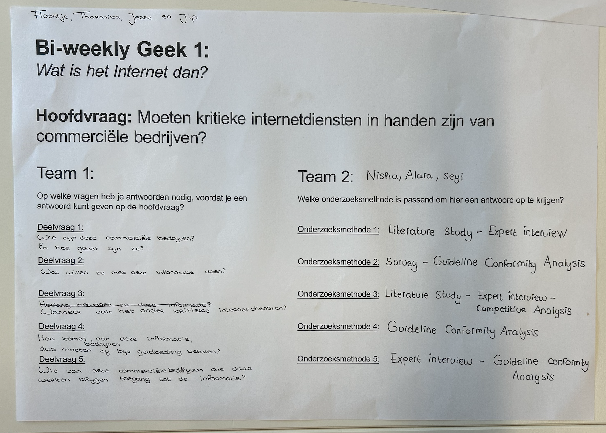 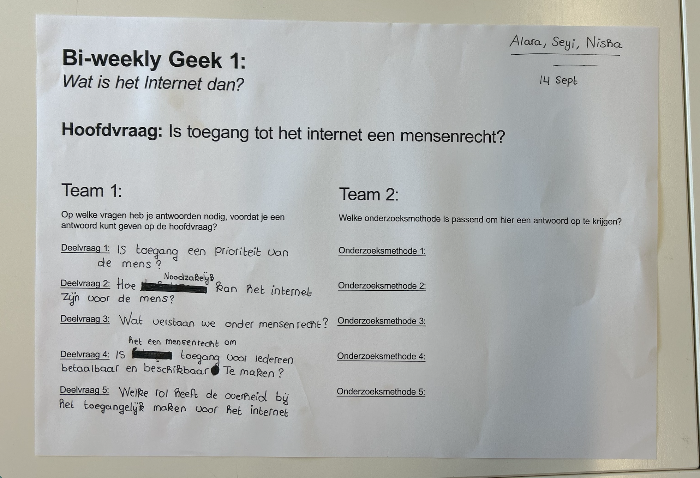

Feedback van Barbara:
-Sfeerwoorden terug verbinden met je website
-Als je erop klikt waar gaat het naartoe? Staat je tekeningen in een overzichts vakjes?
-Als je op een tekening klikt, wordt het vergroot? Werk met responsive Design

# CHECKOUT:

1. Leg uit wanneer een website 'lelijk' wordt en geef voorbeelden wat je kan doen om deze 'lelijke' onderdelen te fixen?

wanneer het bijvoorbeeld veel verschillende kleuren heeft, lettertypes die niet passen en afbeeldingen die niet goed staan. Best een onrustige vibe geven en geen samenhang heeft met het stijl

2. Vertel welke volgende stap je neemt om je website responsive te maken.

   Ik ga ervoor zorgen dat de website goed werkt op verschillende apparaten zoals een laptop, tablet en telefoon door vooral er naar te kijken naar de grootte van afbeeldingen, tekst en knoppen etc.

3. Kun je het ontwerp en de bouw van je eigen Garden (zo uit je hoofd) onderbouwen in Webby vocabulair?

   Ik ga ervoor zorgen dat mijn website aan de volgende voorwaardes voldoen, zodat het webby mogelijk is

# Wat heb ik geleerd?

Tijdens deze les heb ik geleerd dat een goed ontwerp niet alleen gaat over hoe een website eruitziet. Je moet ook nadenken over wat de gebruiker kan doen en hoe de gebruiker door je website heen gaat. Ik had vooral gekeken naar de sfeer en uitstraling, maar moet nu ook meer nadenken over interactie, navigatie en responsive design

# Wat ging goed?

Ik heb een duidelijker idee gekregen van hoe ik mijn tekeningen op mijn website wil laten zien. Vooral het idee om tekeningen in overzichtelijke vakjes te plaatsen en ze groter te laten worden wanneer je erop klikt etc.

# Wat vond ik lastig?

Vooral het nadenken over wat er gebeurt wanneer een gebruiker ergens op klikt en hoe dit op verschillende schermformaten moet werken, zijn dingen waar ik nog mee moet oefenen

# Volgende stap

ik ga mijn website responsive maken en testen op verschillende schermformaten

### 11 sept - WS3 + Voortgang

Feedback alara
Je moet je er toe gaan zetten. Als je code niet leuk vindt schuif je het vooruit.
Ga dingen doen waar je van moet leren. Ga ze doen.

Je haalt het blok door veel code te schrijven.
Ineens kan je op een anderen manier denken.

Ga zelfs, anders mensen zoeken die dit ook hebben (niet willen). En dan mischien samen zitten en werken.
Volgende week vrijdag moet er een website staan.

Alle afbeeldingen in een img tag neerzetten op de juiste plek zodat je het goed en duidelijk kan terug vinden.
Als iets nieuwe schrijf in de read me, schrijf het boven aan, anti chronologisch.

Schrijf er ook bij wat heb je geleerd. Schrijf erbij wat je nu weet wat je dan nog niet wist.
Niet alleen over wat moest, maar wat je had geleerd.

Vergeet de competenties niet. Op die manier leer je het best.
Je maakt gehelen tijd allemaal kleine onderzoekjes, En kleine feedback momentjes ect ect voor een prototype.

Probeer ook veel meer feedback te vragen,
Omdat je met feedback het via iemand ander hun ogen ziet. Van die onverwachtse dingen kan je veel nieuwe dingen krijgen en leren. De genen die heel erg veel beweegt of interacteerdt zijn belangrijk.

# Huiswerk voor 11 sept

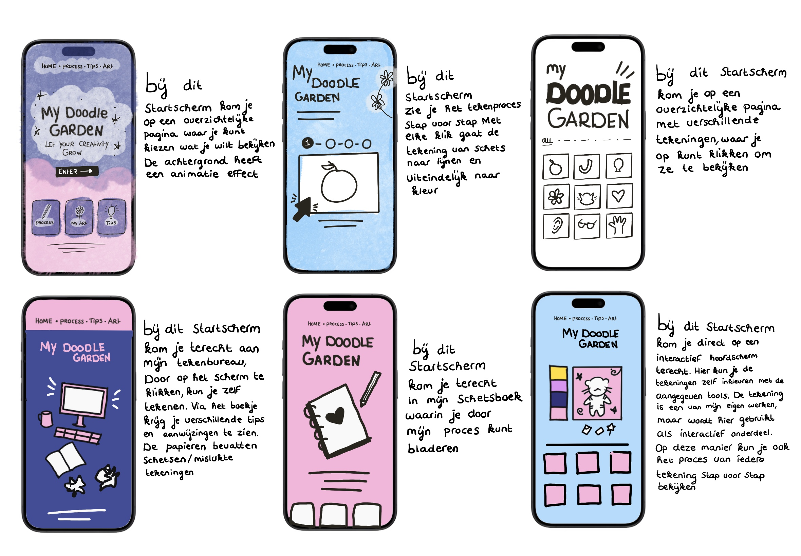

### 9 sept - WS2 + Checkout

Deze les werd online uitgevoerd.

# Visual research

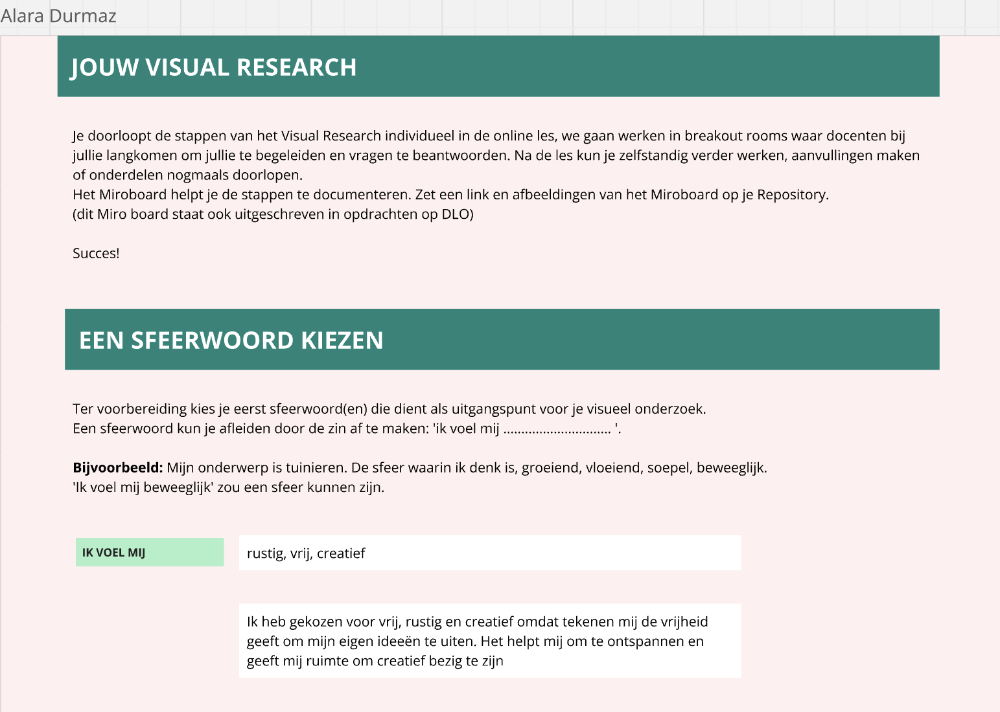 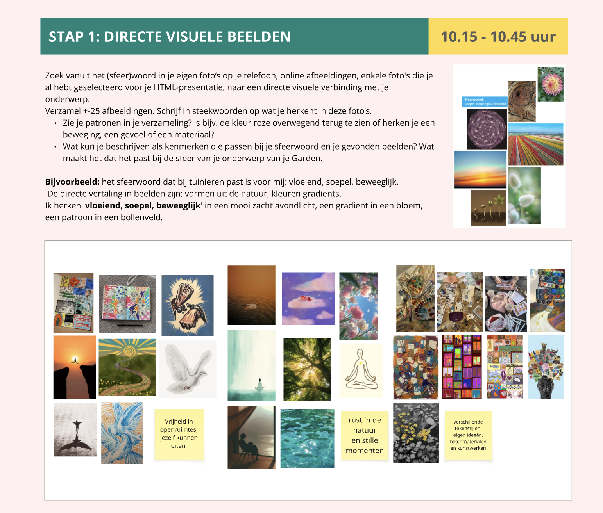
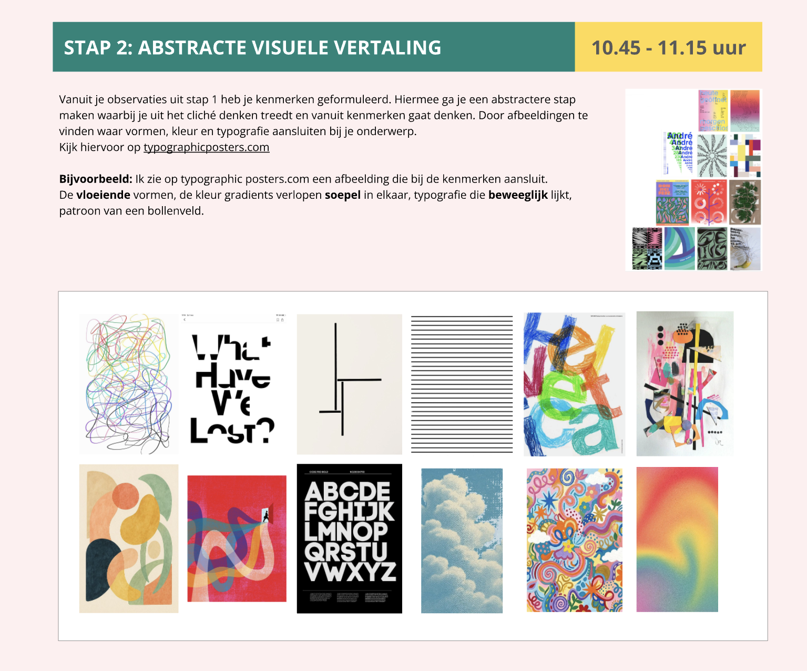 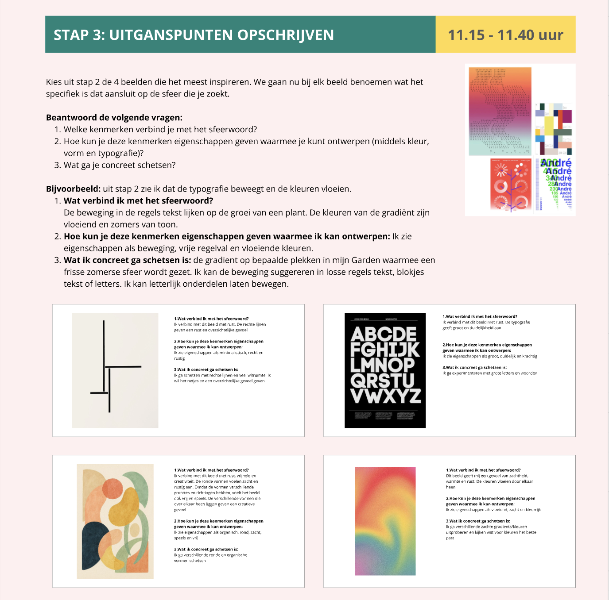
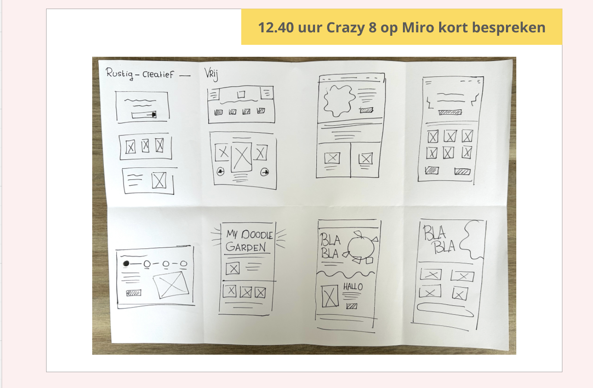 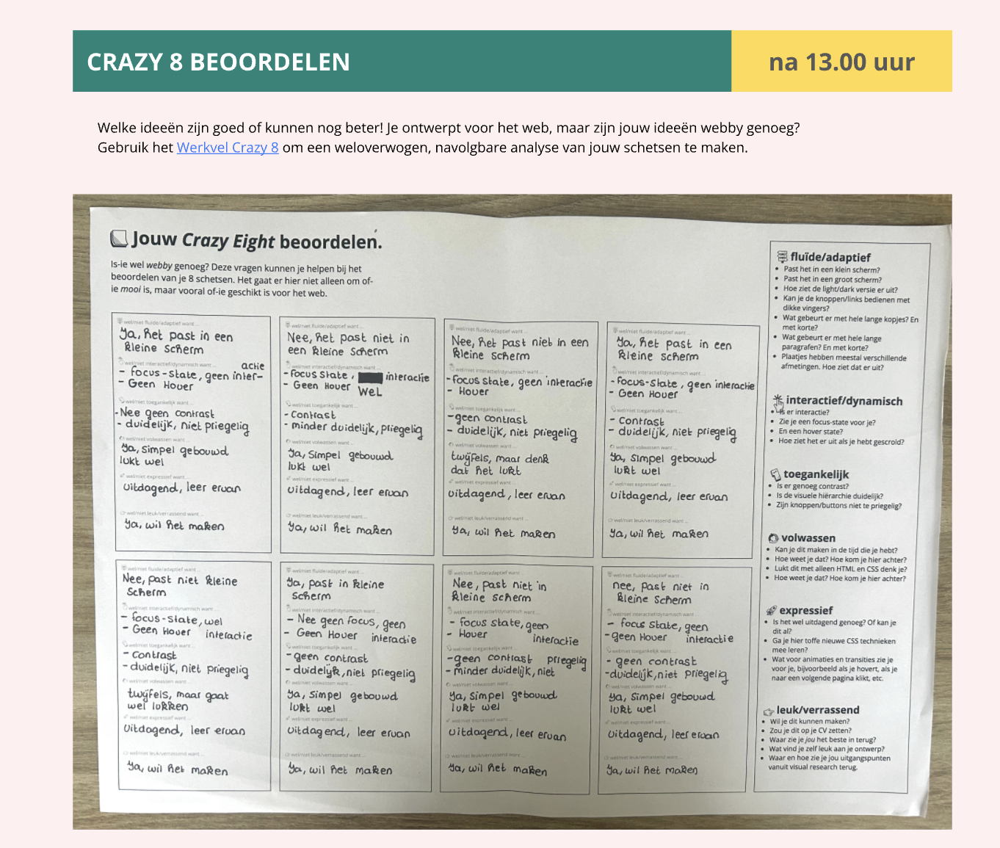

# CHECKOUT:

1. Leg uit waar het Visual Research in 3 stappen naartoe werkt

   Het Visual Research werkt toe naar een duidelijk concept voor mijn Digital Garden. Je verzamelt eerst inspiratie en daarmee doe je onderzoek en uiteindelijk combineer je je ideeen

2. Vertel in 2 zinnen waar jouw Garden over gaat, en met welke content je dat gaat doen (beeld, tekst, sound, animatie enz).

   Mijn Garden gaat over tekenen als hobby en creativiteit. Ik wil dit laten zien met vooral zwart wit kleuren, tekeningen, korte teksten en als het me gaat lukken: animaties!

3. Vertel kort welk idee van de Crazy 8 je het liefst zou willen uitvoeren/ verder zou willen onderzoeken.

   Ik zou graag iets interactiefs willen maken, in plaats van dat bezoekers alleen maar naar tekeningen bekijken. Het proces vind ik ook vooral belangerijk, want het gaat niet alleen maar om perfectie. Dus ik denk dat ik graag me verder zou in willen verdiepen met nummer 5 (2de rij - 1ste)

# Wat heb ik geleerd?

Ik heb geleerd om mijn ideeen eerst breed te onderzoeken voordat ik meteen begin met het maken van mijn website. Hierdoor kan ik beter nadenken over de sfeer en stijl die ik wil gebruiken voor mijn garden
Ik heb ook geleerd om mijn ideeën eerst breed te onderzoeken voordat ik meteen begin met het maken van mijn website. Hierdoor kan ik beter nadenken over de sfeer en stijl die ik wil gebruiken

# Wat ging goed?

Ik vond het fijn om verschillende ideeen snel op papier te kunnen zetten. Hierdoor merkte ik dat ik meer mogelijkheden had voor mijn website

# Wat vond ik lastig?

Ik vond het soms lastig om te bepalen welk idee ik verder wilde uitwerken. Ook moet ik nog uitzoeken hoe ik mijn idee technisch kan uitvoeren met HTML en CSS.

# Volgende stap

Ik wil mijn gekozen Crazy 8 idee verder uitwerken en onderzoeken hoe ik het tekenproces op een interactieve manier kan laten zien in mijn digital Garden

### 7 sept - Sprintplanning - WS1 + Checkout

# OPDRACHT 1: RANGSCHIKKEN

Bij deze werkgroep gingen we in groepjes van 4 kijken naar verschillende websites en het was leuk om te zien dat elke website zijn eigen thema heeft
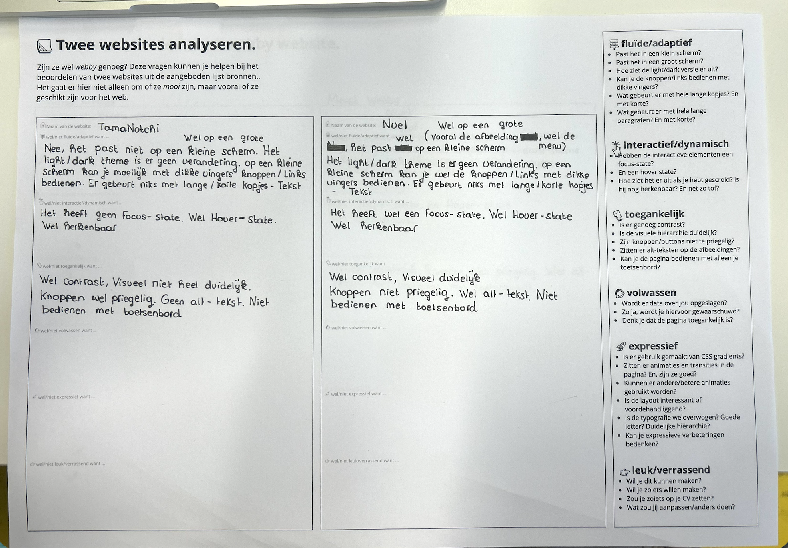 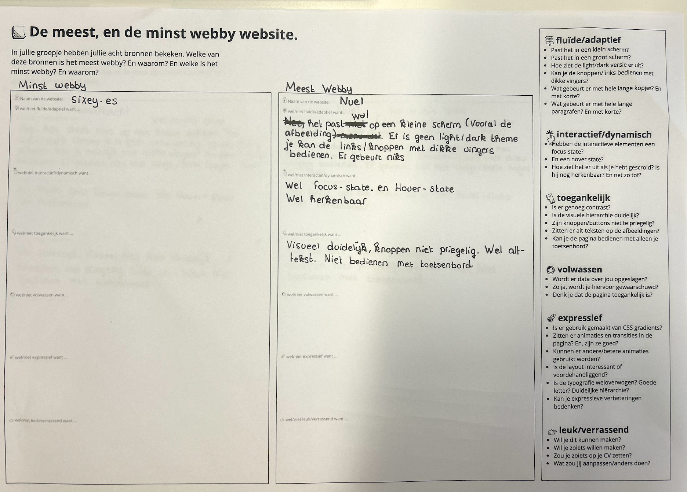

# OPDRACHT 2: EIGEN VERKENNING

De inventaristatie: Ik zat te denken om mijn digital garden te visualiseren in illustraties. Ik hou zelf veel van tekenen, maar heb dat ook een tijdje niet meer gedaan, dus het zou me leuk lijken om daar weer verder mee bezig te zijn. Ik vond de nuel website ook interessant. Elke afbeelding heeft zijn eigen interactie. Dat vond ik best een webby webiste.

De toon: Ik zat te denken om soort tips te geven over illustraties. Het kleurgebruik, welke technieken het handigst is etc.
Mijn doel is om de gebruiker van mijn digital garden een leerzame, goed gevoel te geven. Het combineren met wat ik leuk vind als hobby en iets leerzamer ook voor mij kan zijn.

Mijn content: Vroeger kon ik uren tekenen. Tegenwoordig doe ik het minder, maar mijn liefde voor tekenen is gebleven. In mijn digital garden wil ik ontdekken wat mij hierin blijft inspireren. Hoe het echt mijn eigen content wordt is door mijn eigen werk te laten zien, zoals tekeningen en mijn ervaringen deel.

# CHECKOUT:

1. Leg uit wat een digital garden is en waarom dat anders is dan een reguliere website.

   Een digital garden is een persoonlijke website waar je je ideeën, projecten en dingen die je leert kunt verzamelen. Het verschil met een gewone website is dat een digital garden niet helemaal af hoeft te zijn. Je kunt hem steeds aanpassen en uitbreiden.

2. Wat maakt een website ‘webby’?

Een website is voor mij ‘webby’ als hij creatief, interactief en anders is dan een normale website. Ik vind websites met leuke animaties, bijzondere ontwerpen en interactieve onderdelen inspirerend.

3. Vertel waar jij mee aan de slag wilt gaan bij het maken van jouw eigen digital garden let op: dit zijn jouw eerste ideeën, dit kan en mag veranderen in de loop van het programma.

Ik zat te denken om mijn digital garden te visualiseren in illustraties. Omdat tekenen mijn hobby is die ik tijdje niet heb uitgevoerd.

# Wat heb ik geleerd?

Tijdens deze opdrachten heb ik geleerd om niet alleen naar de inhoud van een website te kijken, maar ook naar de manier waarop een website is vormgegeven en hoe de gebruiker ermee kan omgaan. Door verschillende websites met elkaar te vergelijken, zag ik dat een website heel persoonlijk en creatief kan worden gemaakt

# Wat ging goed?

Ik vond het leuk om verschillende websites te bekijken en inspiratie op te doen. Hierdoor kreeg ik steeds meer ideeen voor mijn eigen digital garden. Vooral het combineren van tekenen, illustraties en interactie lijkt me leuk

# Wat vond ik lastig?

Ik vond het lastig om meteen te bepalen hoe mijn digital garden er precies uit moet gaan zien. Ik heb wel ideeen over het onderwerp en de content, maar de uiteindelijke vormgeving en interactie moeten nog verder worden uitgewerkt. Ook om te bepalen of de websites die we in les hadden behandeld webby zijn volgens het lijstje

# Volgende stap

ik wil mijn ideeen voor de digital garden verder uitwerken en onderzoeken welke stijl, illustraties en interacties goed bij het onderwerp tekenen passen

### 4 sept - Deepdive

Was er helaas niet bij de les.

### 2 sept - Deepdive

S0 - Interactie: MMD, micro-interacties, forms (Nicky)

Opdracht/ Huiswerk (~ 2 uur):
Maak een bruikbaar, online formulier van het Wok to Walk menu voor middelgrote schermen (laptop/tablet). Denk hierbij aan de context (waarom kijken mensen er naar?), de verdeling van de content, en mogelijke toepassingen van micro-interacties.

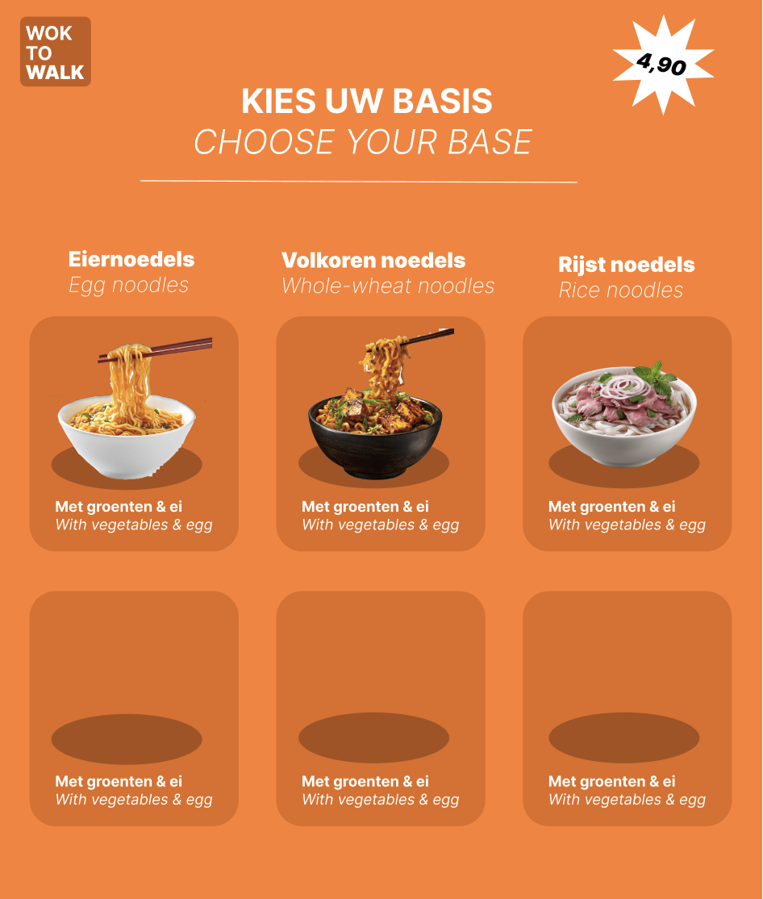

### 31 aug - Kickoff + CHECKOUT

1. Leg uit wat een source hosting platform is en voor welke jij gekozen hebt.

Source hosting platform = Online opslagplek voor programmeercode

2. Vertel welke domeinnaam jij gekozen hebt en hoe je die hebt gekoppeld aan jouw pagina.

Ik heb mijn domeinnaam vernoemd naar “Kirazz” dat is een online username die ik gebruik. Ik heb het gekoppeld via transit.nl en via Github met behulp van DNS

3. Beschrijf hoe je aanpassingen aan jouw pagina kunt maken en hoe je er voor zorgt dat die op het web gepubliceerd worden.

Je kunt je pagina aanpassen in VSCodium en het uploaden door: Commit - Comment - Sync changes en het te pushen naar je GitHub.

# Wat heb ik geleerd?

Vandaag was de eerste dag van school wat best spannend was.. We zijn begonnen met de kickoff en checkout van het project. Ik heb geleerd wat een source hosting platform is en hoe GitHub gebruikt kan worden om mijn code online te bewaren en te publiceren. Ook heb ik geleerd hoe ik mijn domeinnaam via DNS aan mijn website kan koppelen. Het project is erg gericht op HTML en CSS. Dit vind ik zelf best lastig, maar ik heb altijd al interesse gehad om hier beter in te worden.

# Wat ging goed?

Ik heb mijn domeinnaam kunnen koppelen en mijn website online kunnen zetten. Ook begrijp ik nu beter hoe mijn lokale bestanden in VSCodium uiteindelijk online op mijn website terecht komen.

# Wat vond ik lastig?

Nog echt te begrijpen waar het project over gaat en wat er van ons verwacht wordt.

# Volgende stap

Mij verdiepen in het project en informatie uit halen.

## DEEPDIVES

# S1 - Light & Dark theme

Oefening 1 - Light & Dark 101
[Images](assets/Deepdives/Oefening-1-Light-Dark-101/)

Oefening 2 - Twee thema's
[Images](assets/Deepdives/Oefening-2-Twee-themas/)

Oefening 3 - Responsive afbeelding
Heb ik niet af kunnen maken, ben er mee bezig!

# S1 - Mooie kleuren en gradients

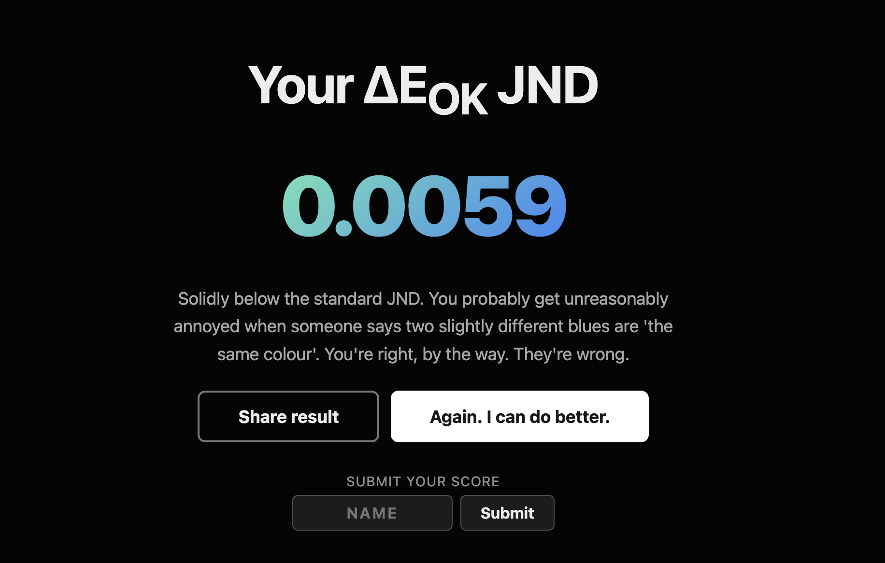

Oefening 1 - De zes gradients
[Images](assets/Deepdives/Oefening1-De-zes-gradients/)

Oefening 2 - Vlaggen en co
[Images](assets/Deepdives/Oefening-2-Vlaggen-en-Co/)

Oefening 3 - Gradients animeren
Heb ik niet af kunnen maken, ben er mee bezig!

# S1 - Grid 101 + Media queries
